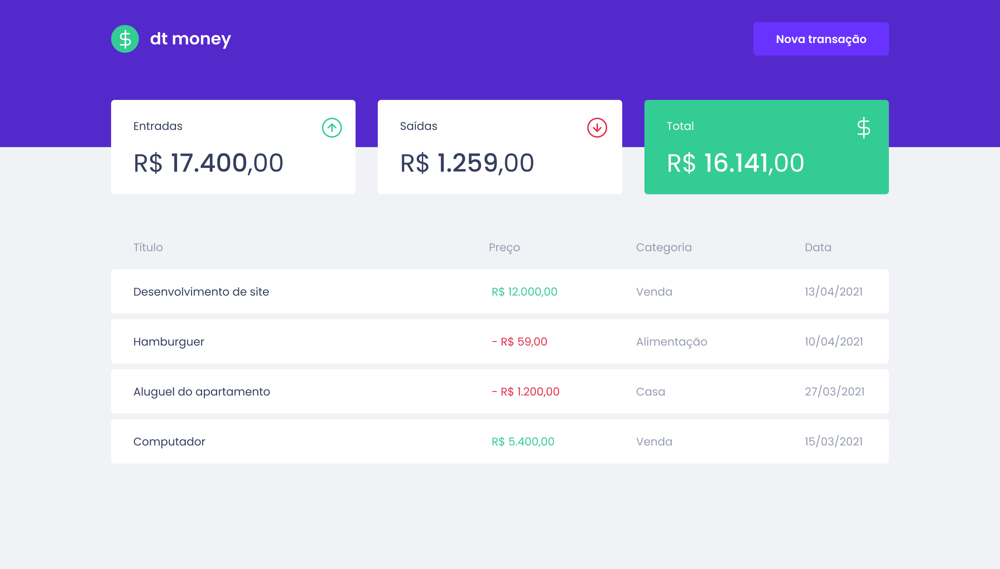
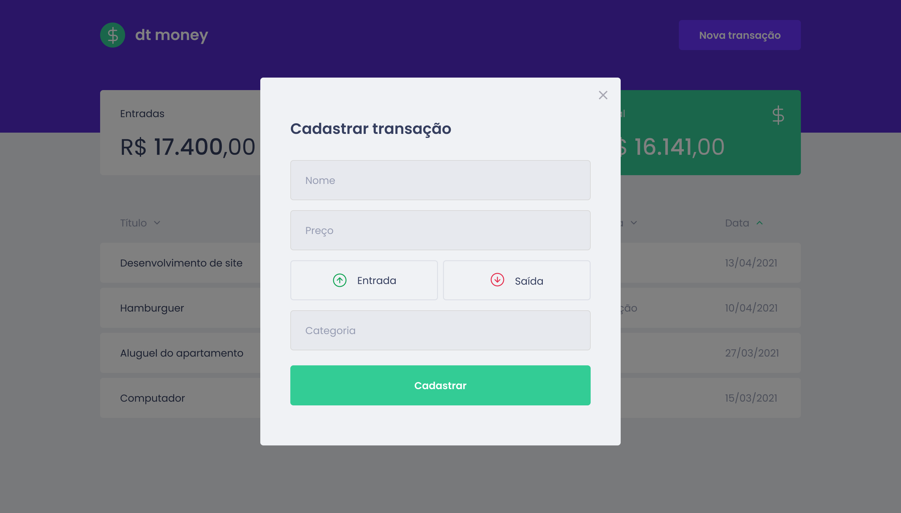

<h1 align="center">
  <a href="#">dtmoney</a>
</h1>

## Layout

## About

dtmoney is a financial control application and it is possible to register and delete transactions and see the inflow and outflow balance.

## Tech, Books and Libraries

- [ReactJS](https://reactjs.org/)
- [TypeScript](https://www.typescriptlang.org/)
- [useState](https://reactjs.org/docs/hooks-reference.html#usestate)
- [useEfect](https://reactjs.org/docs/hooks-reference.html#useeffect)
- [Context API](https://reactjs.org/docs/context.html#api)
- [Styled Components](https://styled-components.com/)
- [Mirage JS](https://miragejs.com/)
- [Axios](https://axios-http.com/docs/intro)
- [React Modal](https://github.com/reactjs/react-modal)
- [Polished](https://polished.js.org/)

---

By [Mayro Myller](https://github.com/mayromyller)
